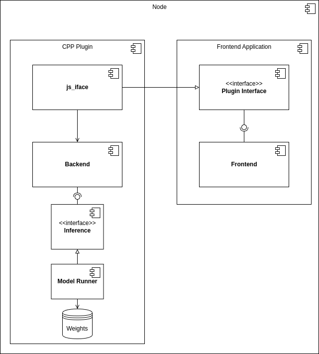
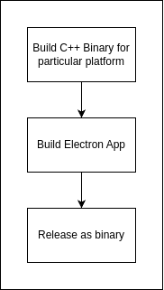

# voice-to-voice

A 2023 attempt at voice-to-voice synthesis

## Overall Architecture

Development is still ongoing and a concrete idea of the architecture is not fully formed. The general aim of the application is to look something like this:

The C++ backend is supposed to handle real-time inference when invoked by the frontend application, which runs on Node.

### Build pipeline

The basic build pipeline, for the time being will:

- Build the C++ Backend first
- Build the electron app using the C++ backend
- Release as executable

As below:

However, this is temporary. It would be more desirable to release installers instead for better integration with each target operating system, as well as tarballs for building from source.

## Building
